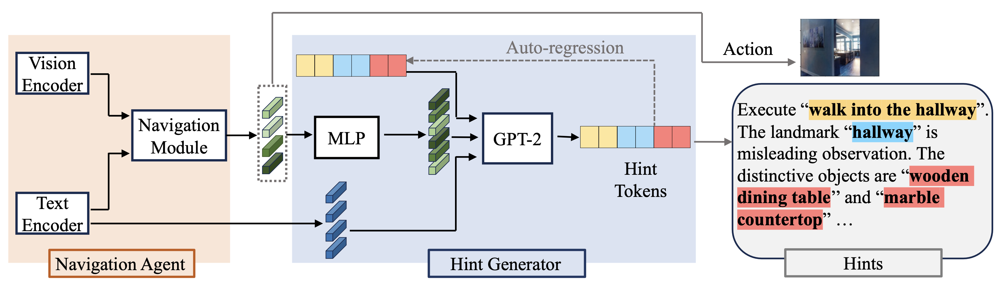

# NavHint: Vision and Language Navigation Agent with a Hint Generator
This repo provides the official implementation of our [Navhint](https://arxiv.org/abs/2402.02559) (EACL2024 Findings)

> Abstract: Existing work on vision and language navigation mainly relies on navigation-related losses to establish the connection between vision and language modalities, neglecting aspects of helping the navigation agent build a deep understanding of the visual environment.
In our work, we provide indirect supervision to the navigation agent through a hint generator that provides detailed visual descriptions.
The hint generator assists the navigation agent in developing a global understanding of the visual environment. It directs the agent's attention toward related navigation details, including the relevant sub-instruction, potential challenges in recognition and ambiguities in grounding, and the targeted viewpoint description. 
To train the hint generator, we construct a synthetic dataset based on landmarks in the instructions and visible and distinctive objects in the visual environment.
We evaluate our method on the R2R and R4R datasets and achieve state-of-the-art on several metrics. 
The experimental results demonstrate that generating hints not only enhances the navigation performance but also helps improve the interpretability of the agent's actions.

### Framework

### Hints Preparation 
 1. [processed sub instruction](https://drive.google.com/drive/folders/1qQ7K2fMkjeNKYANd59KTUUAaKFji3kM8?usp=sharing) (original sub-instruction: [FG-R2R](https://github.com/YicongHong/Fine-Grained-R2R) ) 
 2. [stored candidate viewpoints for each view](https://drive.google.com/file/d/1OzxkRyaFLbPPTlo6IDdjfkaCRrNuBHlr/view?usp=sharing).
 3. [CLIP objects for each viewpoint](https://drive.google.com/file/d/1-d3wa_Plx00XVGxoie1i75x5Zf8u4QPy/view?usp=sharing). 

The generated hints can be obtained by running `python reason_gen.py` or directly from [hints dataset](https://drive.google.com/drive/folders/1LOrW-cIo9J0Qi6k32RYK6gZWQ5yuzoAS?usp=sharing).

### Navigator 

1. [Installing Environment and Downloading Dataset](https://github.com/peteanderson80/Matterport3DSimulator)
2. [Initial weights for Nav-Hint](https://drive.google.com/file/d/1x0szprQKmyts9PvdvunS-trYJtEb9Qt9/view)
3. [Trained Nav-Hint](https://drive.google.com/file/d/1Rnoxpgu_anPdPWJY70gaG38CjelTZgGE/view?usp=sharing) (please put trained weights under snap folder)

**Train Navigator**
> bash run/train_reasoner.bash

**Test Navigator**
> bash run/test_agent.bash
